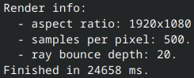

# zig_raytracer

A multithreaded path tracer written in Zig, based on the book series [Ray Tracing in One Weekend](https://raytracing.github.io/books/RayTracingInOneWeekend.html).

## Difrences from the series
- SIMD vector math
- Multithreaded rendering
- PPM image output is in binary

## Example renders




Rendered with default scene at 1920x1080, 500 samples per pixel and 20 ray bounces.
Render time is ~25s on 12 threads. This is on a RelseaseFast build.

## Build Requirements

- Zig, tested on 0.16.0

## Build Instructions

```sh
zig build
```

## Usage
Run the built program at `./zig-out/bin/zig_raytracer`.

This renders the default scene to `output.ppm`, in the current working directory.

