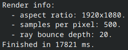
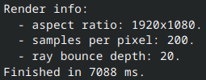

# zig_raytracer

A multithreaded path tracer written in Zig, based on the book series [Ray Tracing in One Weekend](https://raytracing.github.io/books/RayTracingInOneWeekend.html).

## Difrences from the series
- SIMD vector math
- Multithreaded rendering
- PPM image output is in binary

## Example renders

All renders are done on a ReleaseFast build The format is converted from .ppm to .png using ImageMagick. Rendered on a i7-9850H, so render is done on 12 threads.




Rendered with default scene at 1920x1080, 500 samples per pixel and 20 ray bounces.
Render time is ~18s.


 

Reducing the spp down to 200 gets the render time down to ~7s but with visible noise increase.

## Build Requirements

- Zig, tested on 0.16.0

## Build Instructions

```sh
zig build
```

## Usage
Run the built program at `./zig-out/bin/zig_raytracer`.

This renders the default scene to `output.ppm`, in the current working directory.

